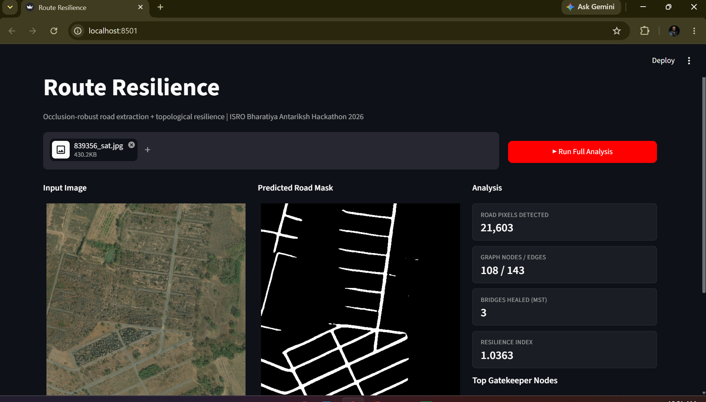
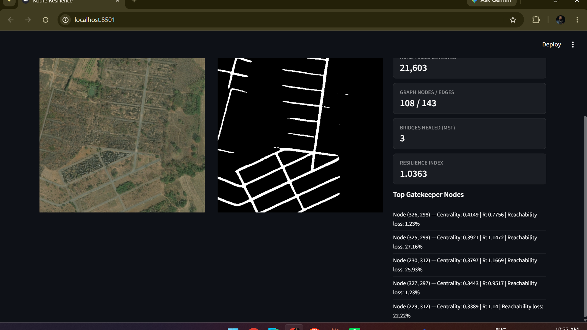

<div align="center">

# 🛰️ Route Resilience

### Topological Inference and Deterministic Stress-Testing for Occluded Road Networks

*Built for the ISRO Bharatiya Antariksh Hackathon 2026*

</div>

---

## The Problem

Standard satellite road-extraction pipelines treat road detection as a pure pixel-segmentation problem. Under tree canopy, cloud cover, and building shadows, this produces **fragmented, disconnected masks** — visually plausible, but mathematically useless for routing. A road graph with a gap in it is not a road graph; it is two unrelated graphs that happen to be drawn on the same image.

This project starts from a different premise: **a road network is a graph, not a picture.** Every stage of the pipeline — from segmentation to centrality analysis — is built to preserve and exploit that structure.

---

## What Makes This Different

Most occlusion-handling approaches stop at trying to make the segmentation model "see through" cover more accurately. That is necessary but not sufficient — no segmentation model is perfect, and gaps will always exist at the pixel level.

Route Resilience treats the gap itself as a **solvable graph problem**:

| Stage | Standard Approach | This System |
|---|---|---|
| Output | Binary pixel mask | Weighted, routable graph |
| Occlusion handling | Better segmentation only | Segmentation **+** algorithmic topological healing |
| Gap bridging | None / manual GIS cleanup | Minimum Spanning Tree + Disjoint Set, constrained by Euclidean distance **and** angular trajectory |
| Vulnerability analysis | Static map, visual inspection | Deterministic node-ablation stress-test producing a quantifiable Resilience Index |

The result is a system that doesn't just ask *"where are the roads?"* — it asks *"if this junction fails, what breaks, and by how much?"*

---

## System Architecture

```
┌─────────────────┐    ┌──────────────────────┐    ┌────────────────────┐    ┌─────────────────────┐
│   DATA INGESTION │ -> │    AI SEGMENTATION    │ -> │ TOPOLOGICAL HEALING │ -> │ RESILIENCE DASHBOARD │
│                  │    │                      │    │                    │    │                     │
│  Satellite tile  │    │  U-Net + ResNet34     │    │  Skeletonize  →    │    │  Betweenness         │
│  (DeepGlobe /    │    │  encoder-decoder,     │    │  Build Graph  →    │    │  Centrality  →       │
│  Sentinel-2 /    │    │  trained with         │    │  MST + Disjoint    │    │  Node Ablation  →    │
│  Cartosat-3      │    │  synthetic canopy +   │    │  Set bridging,     │    │  Resilience Index    │
│  ready)          │    │  shadow occlusion     │    │  angular-alignment │    │  (baseline ASPL /    │
│                  │    │  augmentation         │    │  filtered          │    │  perturbed ASPL)     │
└─────────────────┘    └──────────────────────┘    └────────────────────┘    └─────────────────────┘
```

Four phases, each independently testable, each backed by working code in this repository — not a concept diagram.

---

## Core Technical Components

### 1. Occlusion-Robust Segmentation
A U-Net decoder over a pretrained ResNet34 encoder (24.4M parameters), fine-tuned on the DeepGlobe Road Extraction dataset. Training images are augmented with **synthetic canopy and shadow patches** — overlaid on the input image while the ground-truth mask is left untouched — forcing the model to infer road continuity it cannot directly see, rather than just memorizing visible road texture.

### 2. Algorithmic Topological Healing
The predicted mask is reduced to a 1-pixel-wide skeleton, then collapsed further into a **junction-only graph**: nodes exist only at intersections and endpoints, with edge weights equal to the true walked path length between them. This keeps graphs compact (tens to low hundreds of nodes, even for dense urban tiles) without losing any topological information — critical for making exact shortest-path computations tractable.

Disconnected components — gaps caused by occlusion — are bridged using a **Minimum Spanning Tree over candidate connections**, where each candidate is scored by Euclidean distance *and* angular alignment with the existing road trajectory. A bridge is only accepted if it continues a plausible straight or gently curving path; a candidate that would force an unnatural sharp turn is rejected outright. A Disjoint Set (Union-Find) structure ensures the minimum number of bridges are added — exactly enough to reconnect the network, no more.

### 3. Structural Bottleneck Identification
Betweenness Centrality is computed over the healed graph to rank every junction by how many shortest paths pass through it. The highest-ranked nodes are the network's **Gatekeeper Nodes** — the points whose failure would do the most damage to overall connectivity.

### 4. Deterministic Resilience Stress-Testing
Each Gatekeeper Node is individually ablated (removed) from the graph. For each ablation, the system computes:

**Resilience Index (R) = Average Shortest Path Length (baseline) / Average Shortest Path Length (perturbed)**

R close to 1.0 indicates the network absorbed the failure with minimal disruption. R approaching 0 indicates the node was a true single point of failure — its removal fragmented the network or drastically lengthened remaining routes. Fragmentation is penalized explicitly (not hidden by measuring path length only within a shrunken surviving component), so a network that breaks apart cannot score as artificially "resilient."

This is not a heuristic score — it is a deterministic, reproducible computation over the actual graph structure, run identically every time on the same input.

---

## Demo

<div align="center">

**Input → Segmentation → Topological Healing → Resilience Analysis, in one click**



*Complex urban tile: 21,603 road pixels detected, reduced to a 108-node / 143-edge junction graph, 3 occlusion gaps healed via MST, Resilience Index 1.0363*



*Top-ranked Gatekeeper Nodes with individual ablation results — centrality score, resulting Resilience Index, and reachability loss per node*

</div>

---

## Tech Stack

| Layer | Tools |
|---|---|
| Deep Learning | PyTorch, torchvision (ResNet34 backbone) |
| Image Processing | OpenCV, scikit-image, Albumentations |
| Graph Theory | NetworkX |
| Backend | FastAPI |
| Frontend | Streamlit |
| Training Infra | Google Colab (T4 GPU) |

---

## Pipeline Status

| Phase | Status |
|---|---|
| Data pipeline (DeepGlobe, occlusion-augmented) | ✅ Complete |
| Segmentation model (trained, 20 epochs) | ✅ Complete |
| Topological healing (MST + Disjoint Set + angular filtering) | ✅ Complete |
| Junction-graph optimization | ✅ Complete |
| Resilience Index computation | ✅ Complete |
| End-to-end API (FastAPI) | ✅ Complete |
| Interactive dashboard (Streamlit) | ✅ Complete |
| Sentinel-2 / Cartosat-3 validation | 🔵 In progress |

The architecture is config-driven by design — switching the data source from DeepGlobe to Sentinel-2 or Cartosat-3 requires changing a single field in `config.yaml`, not rewriting the pipeline.

---

## Getting Started

```bash
git clone https://github.com/ravi-dev-7/route-resilience.git
cd route-resilience

python -m venv venv
venv\Scripts\activate   # Windows
pip install -r requirements.txt

# Terminal 1 - backend
python -m uvicorn api.main:app --reload

# Terminal 2 - dashboard
streamlit run frontend/app.py
```

---

<div align="center">

*Built solo, end-to-end — model training, graph algorithms, backend, and dashboard — for the ISRO Bharatiya Antariksh Hackathon 2026.*

</div>
